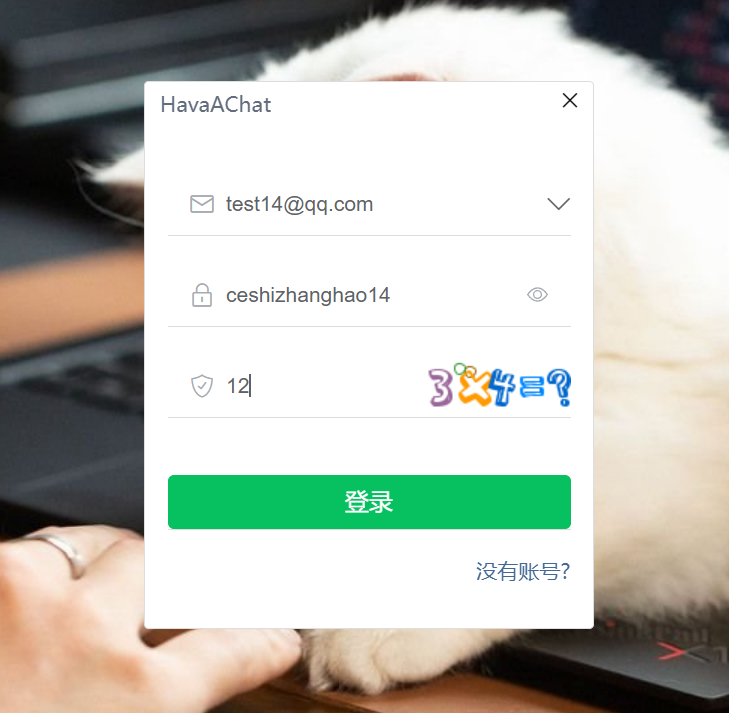
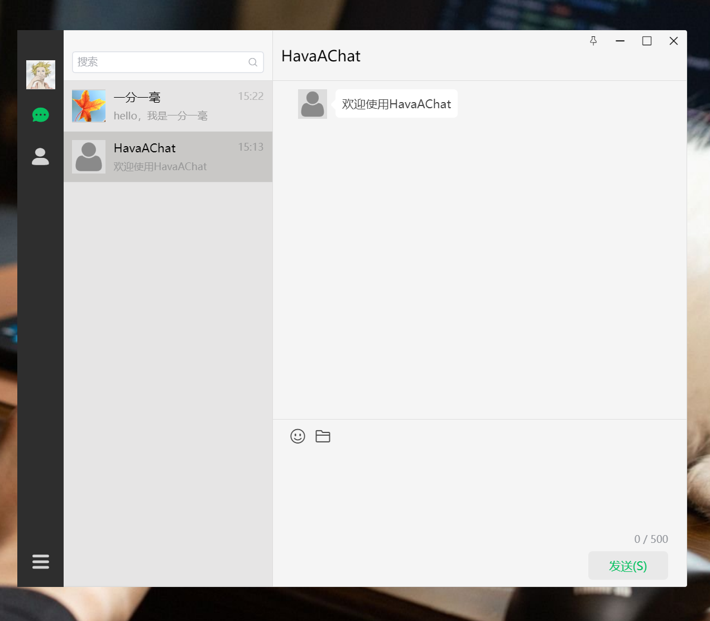
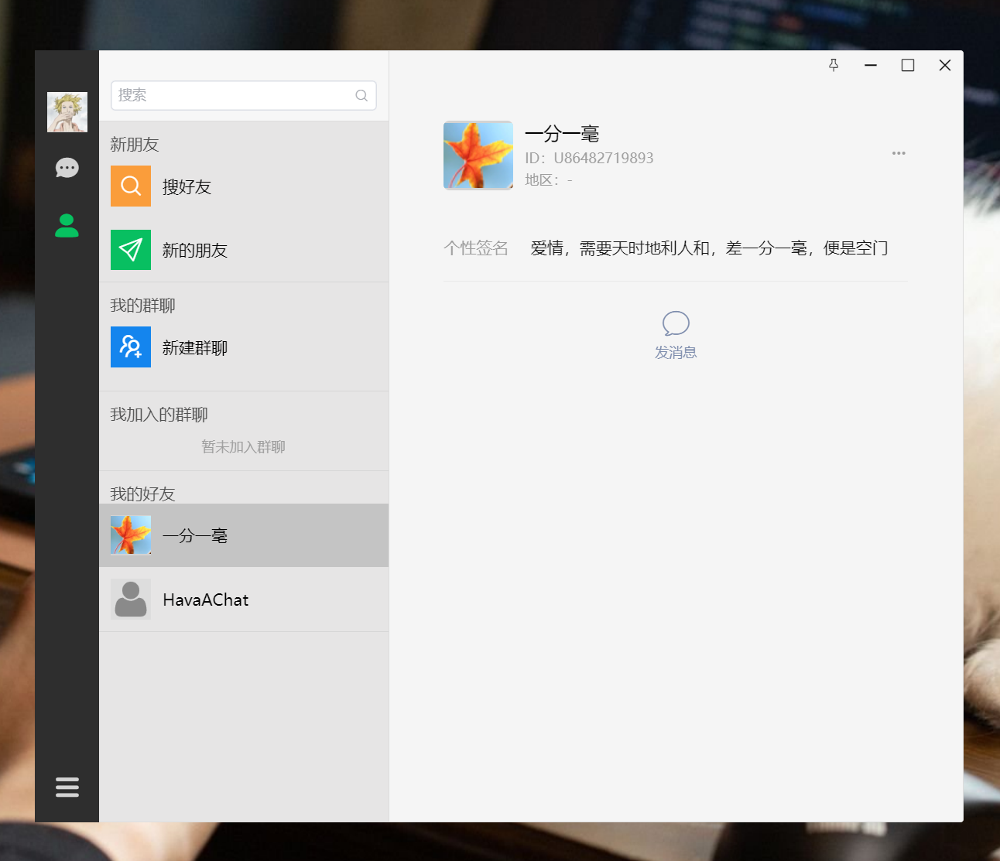
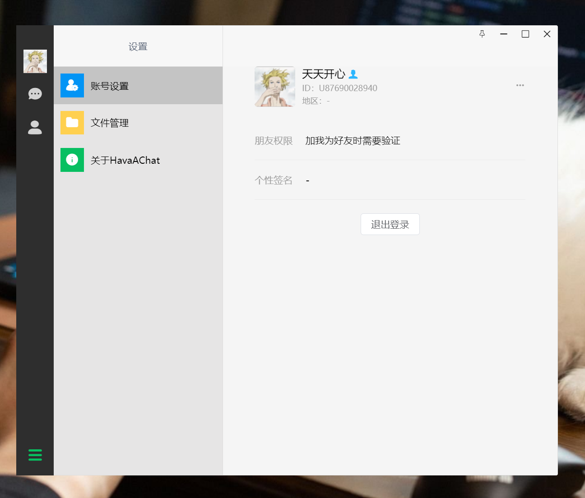
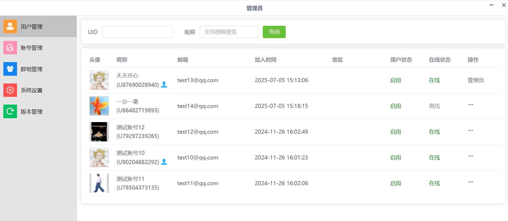
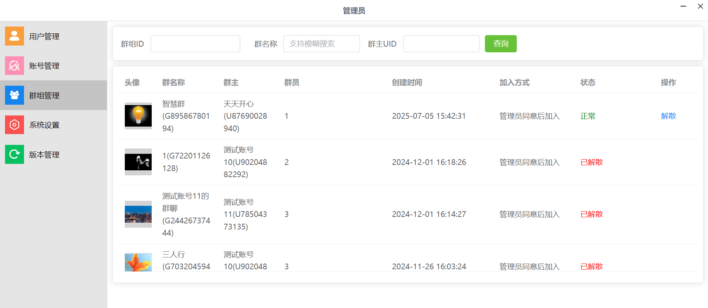

# HavaAChat 即时通讯软件项目介绍

## 一、项目概述
HavaAChat 是一款功能强大的即时通讯软件，其功能涵盖实时聊天、好友关系管理以及后台管理等多个重要方面。该项目旨在为用户提供一个安全、高效、便捷的即时通讯体验。

## 二、核心功能

### （一）用户模块
- **登陆注册**：支持用户进行注册和登录操作，确保账号的安全性和唯一性。
- **Token 鉴权**：采用 Token 鉴权机制，保障用户登录状态的安全性和有效性。
- **个人信息维护**：用户可以自由修改和维护个人信息，如头像、昵称等。
- **在线状态感知**：利用 Redis 实现用户在线状态的实时感知，能够实现秒级下线感知，让用户随时了解好友的在线状态。

### （二）聊天模块
- **单聊/群聊消息收发**：支持用户进行一对一的单聊和多人的群聊，消息类型包括文字、图片和文件，满足多样化的沟通需求。
- **实时推送**：基于 Netty 长连接技术，实现消息的实时推送，确保消息能够及时送达。
- **离线消息补推**：当用户处于离线状态时，系统会自动保存离线消息，并在用户上线后进行补推，保证消息不丢失。

### （三）社交关系
- **好友全生命周期管理**：提供好友搜索、添加、删除和拉黑等功能，方便用户管理自己的好友关系。
- **群组维护**：支持用户创建群组、邀请成员、踢除成员和解散群组，满足用户的群组交流需求。

### （四）管理后台
- **用户管理**：管理员可以对用户进行管理，包括更改用户信息、封禁用户和强制用户下线等操作。
- **群组管理**：支持对群组进行检索、更改群组信息和强制解散群组等操作。
- **版本更新与灰度发布**：提供版本更新功能，支持灰度发布，即只向部分用户推送版本更新，以便进行测试和验证。

## 三、项目设计

### （一）安全体系
采用 Interceptor 路由拦截、AOP 权限控制和 Token 进行三重鉴权，有效拦截恶意接口请求，保障系统的安全性。

### （二）缓存机制
使用 Redis 实现用户心跳检测、验证码时效控制和联系人列表缓存等功能，优化数据读取效率，提高系统的响应速度。

### （三）交互设计
对好友申请、删除和拉黑等用户交互业务设置多级校验机制，确保多个体交互行为严格符合业务逻辑，提高用户体验的流畅性和准确性。

## 四、版本更新发布

### （一）版本更新实体类
`AppUpdate` 类用于表示版本更新信息，包含版本号、更新描述、更新方式（未发布、灰度发布、全网发布）、灰度发布 uid、更新文件类型（本地文件、外链）和外链地址等属性。

### （二）版本更新服务
`AppUpdateServiceImpl` 类提供了版本更新的相关服务，包括获取版本更新列表、新增或修改版本、删除版本、发布版本和获取最新版本等功能。具体如下：
- **获取版本更新列表**：根据分页信息和创建日期范围查询版本更新列表。
- **新增或修改版本**：新增版本时，版本号必须大于历史最大版本号；修改版本时，若修改版本号，需满足相应的版本号规则，且已发布的版本不能修改。同时，支持将版本文件存至本地。
- **删除版本**：已发布的版本不能删除。
- **发布版本**：支持灰度发布和全网发布，灰度发布时需要指定发布列表。
- **获取最新版本**：根据用户当前版本和用户 id 查询最新版本信息，并返回给前端展示。

## 五、文件路径工具类
`FilePathUtils` 类提供了一系列文件路径生成方法，包括生成存储头像文件、版本文件、上传文件的文件夹路径和文件路径等，方便文件的存储和管理。

## 六、使用说明
### （一）环境要求
确保你的开发环境中已经安装了 Java、Maven 和 Redis 等必要的软件。

### （二）项目部署
1. 克隆项目代码到本地：
```bash
git clone https://github.com/hardtochill/HavaAChat.git
```
2. 进入项目根目录，使用 Maven 进行项目构建：
```bash
mvn clean install
```
3. 配置项目的数据库连接和 Redis 连接信息，修改 `application-dev.yml` 配置文件。
4. 启动项目：
```bash
java -jar target/HavaAChat.jar
```

### （三）项目使用
- 访问项目的前端页面，进行注册和登录操作。
- 在前端页面中进行聊天、添加好友、创建群组等操作。
- 管理员可以访问管理后台，进行用户管理、群组管理和版本更新等操作。

## 七、展示
### （一）登录界面

### （二）聊天界面

### （三）好友列表

### （四）用户信息

### （五）后台管理




